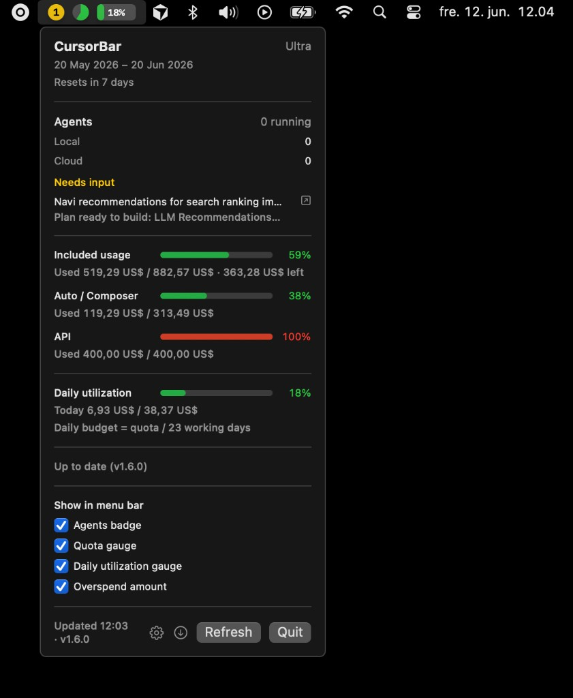

# CursorBar

A lightweight macOS menu bar app that shows your Cursor plan usage and how much you have left this billing cycle.

No browser tab, no manual cookie paste — CursorBar reads your session from the local Cursor IDE database and fetches usage from Cursor's dashboard API.



## Features

- **Agents badge** — circular indicator to the left of the quota gauge showing live agent count (local + cloud): green with count when running, yellow with count when agents need your input (tool approval or plan ready to build), red `0` when idle; dropdown lists agents needing input and opens them in Cursor when clicked
- **Menu bar gauges** — quota gauge (`Q`) and daily utilization gauge (`D`), plus a red overspend amount when overspending
- **Configurable menu bar** — toggle each element (agents, quota, daily utilization, overspend) via the gear button in the dropdown
- **Daily utilization** — today's spend measured against a daily budget (total quota / working days in the billing cycle)
- **Usage breakdown** — dollar amounts used, total credits (including bonus), and remaining balance
- **Overspend tracking** — shows charges beyond included credits and on-demand spend with budget/remaining
- **Billing cycle info** — current period dates and days until reset
- **Auto-refresh** — on launch and every 5 minutes
- **Manual refresh** — click Refresh in the dropdown anytime
- **Built-in updates** — checks GitHub for new versions on startup, with a manual check button and one-click update from the dropdown

## Requirements

- macOS 14 (Sonoma) or later
- [Cursor IDE](https://cursor.com) installed and signed in on this Mac
- Swift 6 — only needed if [building from source](#build-from-source)

## Install

### Homebrew (recommended)

```bash
brew tap c-johannesen/cursorbar
brew install cursorbar
```

Or without adding the tap permanently:

```bash
brew install c-johannesen/cursorbar/cursorbar
```

This installs `CursorBar.app` to `/Applications`. Open it from Applications or run:

```bash
open -a CursorBar
```

### Build from source

```bash
git clone https://github.com/c-johannesen/cursorbar.git
cd cursorbar
bash scripts/install.sh
```

This builds CursorBar locally, installs it to `/Applications/CursorBar.app`, and opens it.

### Launch later

```bash
open -a CursorBar
```

Or, if you built from source:

```bash
bash scripts/launch.sh
```

## Usage

| Menu bar | Click to open dropdown |
|----------|------------------------|
| `[1] Q 42% D 85%` | Agents badge, quota/daily gauges, overspend (when applicable), plan details, refresh & quit |

**Agents badge** (left of the gauges):

- Green with a number — that many agents are running (local + cloud)
- Yellow with a number — that many agents need your input (tool approval or plan ready to build)
- Red `0` — no agents running

Agent status is read from local Cursor IDE data (transcripts and `state.vscdb`). Cloud agent status and plan/input flags can lag the UI by a minute or two because the IDE debounces writes to disk. Click an agent under **Needs input** to focus it in the Cursor app.

**Color in dropdown** (progress bar and percentage):

- Green — under 70% used
- Yellow — 70–89%
- Red — 90% or higher

**Auto-refresh:** immediately on launch, then every **5 minutes** while the app is running.

**Errors:** if something goes wrong, the menu bar shows `!` — open the dropdown for details.

## Troubleshooting

Check that CursorBar can read your account:

```bash
/Applications/CursorBar.app/Contents/MacOS/CursorBar --status
```

Expected output: `OK 42%` (your percentage will differ).

Common issues:

| Problem | Fix |
|---------|-----|
| `!` in menu bar | Make sure Cursor is installed and you're signed in, then click **Refresh** |
| App won't open from Finder | Run `bash scripts/launch.sh` — it clears Gatekeeper quarantine flags |
| `Swift is not installed` | Run `xcode-select --install` |
| `No auth token found` | Sign out and back into Cursor, then relaunch CursorBar |

## How it works

1. Reads `cursorAuth/accessToken` from Cursor's local SQLite database  
   `~/Library/Application Support/Cursor/User/globalStorage/state.vscdb`
2. Derives a session cookie from the JWT
3. Calls `GET https://cursor.com/api/usage-summary`

The token is read fresh on every refresh and is **never stored** by CursorBar.

## Development

```bash
git clone https://github.com/c-johannesen/cursorbar.git
cd cursorbar

# Build only
bash scripts/package.sh

# Build, install to /Applications, and launch
bash scripts/package.sh --install --open

# Verify API access
.build/release/CursorBar --status
```

Project layout:

```
Sources/CursorBar/
  App.swift           # MenuBarExtra UI
  AgentMonitor.swift  # Live agent count & needs-input detection
  TokenProvider.swift # Read auth from Cursor IDE DB
  CursorAPI.swift     # Fetch usage-summary
  UsageStore.swift    # Refresh timer & display state
  UpdateChecker.swift # GitHub release updates
scripts/
  install.sh          # One-step install
  launch.sh           # Start the app
  package.sh          # Build .app bundle
```

## Limitations

- Uses Cursor's **undocumented** dashboard API — may break without notice
- Agent status is inferred from local IDE files — may lag the UI or miss edge cases
- Individual Cursor accounts only (reads your local IDE session)
- Not signed with an Apple Developer ID — first launch may require right-click → Open, or use `scripts/launch.sh`

## Contributing

Pull requests are welcome — see [CONTRIBUTING.md](CONTRIBUTING.md).

The `main` branch is protected: only the repository owner can push to or merge into `main`. Everyone else should fork the repo and open a PR.

## License

MIT — see [LICENSE](LICENSE).
